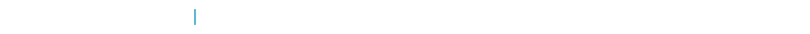

<h1 align="center">llr-selfgit</h1>

  

  

  
  
  
  

## About

某司算法工程师，关注搜广推、因果推断、大模型 Agent 等领域。

## Works

| Project | Notes |
| --- | --- |
| [R3F Particle Portfolio](https://github.com/llr-selfgit/r3f-particle-portfolio) | 一个围绕 React Three Fiber 单画布、粒子变形和个人网站体验搭建的作品模板。 |

  

